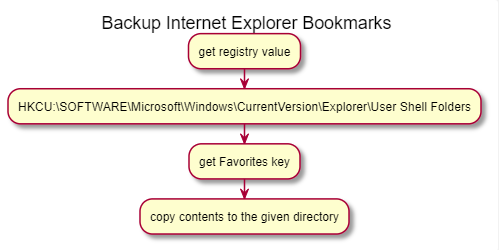
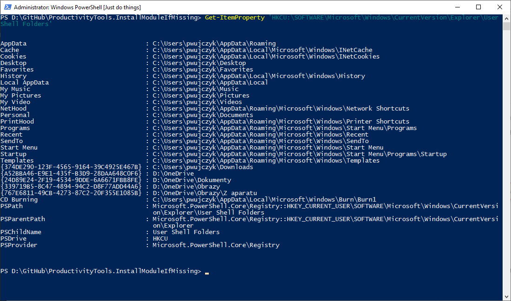
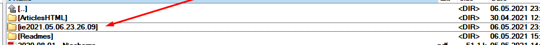

<!--Category:PowerShell--> 
 <p align="right">
    <a href="https://www.powershellgallery.com/packages/ProductivityTools.BackupBookmarksIE/"></a>
    <a href="http://productivitytools.tech/backup-bookmarks-ie/"><a> 
    <a href="https://github.com/pwujczyk/ProductivityTools.BackupBookmarksIE/"></a>
</p>
<p align="center">
    <a href="http://http://productivitytools.tech/">
        
    </a>
</p>

# Backup Bookmarks IE

Copy all Internet Explorer bookmarks to the given path.

<!--more-->

Module reads the registry to locate the favorites path and copy all the contents to the given localization. 



Registry key with Favorites property.




```PowerShell
Backup-BookmarksIE -Destination D:\Trash\ 
```

Module allows to use couple of the switches which helps organize backups
- Destination - path where backup should be placed
- ToDateDirectory - if used directory with the date name will be created. Date will have format yyyy.MM.dd.hh.mm.ss. For example 2017.12.02.08.56.16. 
- DateNamePrefix - it allows to add some words before date (checkout example)
- DateNameSuffix - as above
- ToPersonalOneDrive - it will backup favorites to personal one drive. You don't need to provide what is the real OneDrive location
- ToBusinessOneDrive - as above

```PowerShell
Backup-BookmarksIE -Destination D:\Trash\ -ToDateDirectory -DateNamePrefix ie
```


